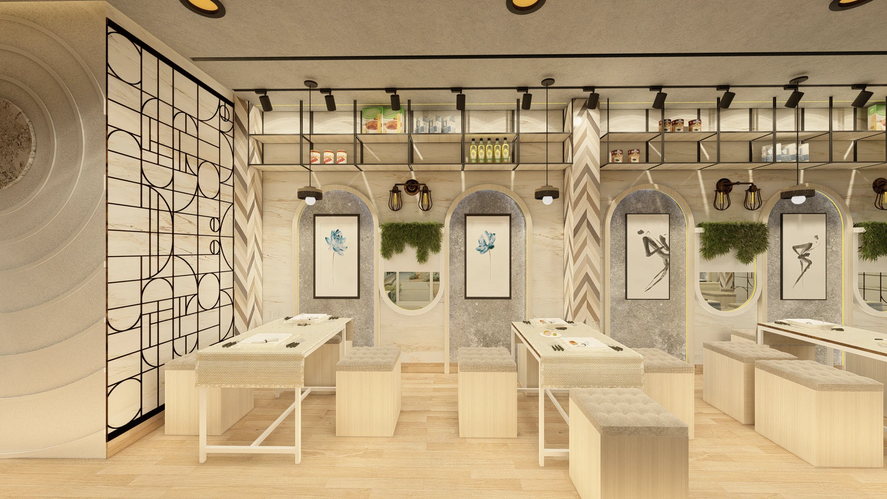

# Discover Architects

## Overview
Discover Architects is a web platform for architecture and interior design services. It allows users to explore design galleries, subscribe to membership plans, and for admins to manage users and their subscriptions. The site is currently a work in progress and new features are being added.

## Tech Stack
- **Frontend:** React, TypeScript, Tailwind CSS
- **Backend:** Node.js, Express, TypeScript
- **Database:** SQLite (via better-sqlite3)
- **Other:** Supabase (for authentication), Multer (for file uploads)

## How to Run the Project

### 1. Clone the Repository
```
git clone <repo-url>
cd Discover_architects-master
```

### 2. Install Dependencies
#### Frontend
```
npm install
```
#### Backend
```
cd backend
npm install
```

### 3. Start the Project
#### Start Backend
```
cd backend
npm start
```
#### Start Frontend (in a new terminal)
```
cd ..
npm start
```
- The frontend will run at [http://localhost:3000](http://localhost:3000)
- The backend will run at [http://localhost:5000](http://localhost:5000)

## Features
- User authentication (with Supabase)
- Admin dashboard to manage users and plans
- User dashboard to view and manage subscriptions
- Gallery for design inspiration
- Membership plans and subscription management

## Status
This project is **in progress**. Some features may be incomplete or under development.

## UI Screenshots

You can showcase the user interface by adding screenshots below. To add a screenshot, place your image in the `public/` directory and use markdown like this:

```md

```

### Example Screenshots

<!-- Add your UI screenshots here -->

- 
- 

<!-- Add more screenshots as your UI evolves -->

